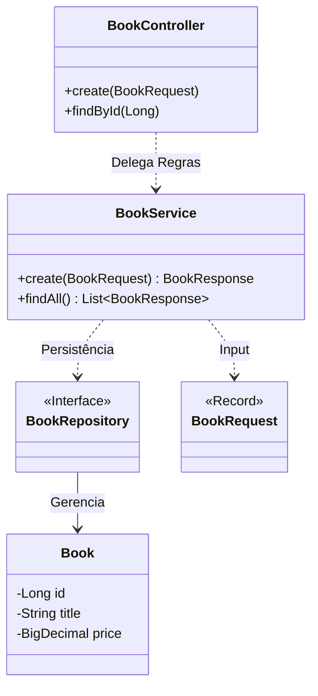

# 📚 Book Service (Provider)

Microsserviço responsável pela gestão do catálogo de produtos e controle de estoque. Atua como a **Fonte da Verdade** (Source of Truth) para os dados bibliográficos na plataforma.

---

## 🏗️ Arquitetura Interna

O projeto segue estritamente a separação de responsabilidades, utilizando **Records (DTOs)** para blindar o modelo de domínio (Entidade JPA) contra exposição indevida na API.



-----

## ⚙️ Configuração (Variáveis de Ambiente)

Seguindo as práticas **Twelve-Factor App**, toda configuração sensível é injetada via variáveis de ambiente.

| Variável | Descrição | Valor Padrão (Local) |
| :--- | :--- | :--- |
| `SERVER_PORT` | Porta HTTP do serviço | `8081` |
| `DB_URL` | String de conexão JDBC | `jdbc:postgresql://localhost:5432/bookstore_db` |
| `DB_USER` | Usuário do banco | `postgres` |
| `DB_PASS` | Senha do banco | `postgres` |

-----

## 🔌 API Reference

### 1\. Criar Livro

`POST /books`

**Request Body (JSON):**

```json
{
  "title": "Clean Architecture",
  "author": "Robert C. Martin",
  "price": 120.00,
  "availableStock": 50
}
```

**Validations:**

  * `price`: Deve ser positivo.
  * `availableStock`: Deve ser positivo ou zero.

### 2\. Consultar por ID

`GET /books/{id}`

**Response (200 OK):**

```json
{
  "id": 1,
  "title": "Clean Architecture",
  "author": "Robert C. Martin",
  "price": 120.00,
  "availableStock": 50
}
```

-----

## 📊 Observabilidade & Saúde

O serviço expõe métricas via **Spring Boot Actuator** para monitoramento em produção.

| Endpoint | Método | Função |
| :--- | :--- | :--- |
| `/actuator/health` | GET | Status da aplicação e conexão com DB (Liveness Probe). |
| `/actuator/info` | GET | Informações de build e versão. |
| `/actuator/metrics` | GET | Métricas de JVM, GC e Threads. |

-----

## ✅ Qualidade de Código (QA)

A integridade do código é garantida por uma suíte de testes automatizados com cobertura mínima de **80%**.

  * **Unitários (`Service`):** Isolados com `Mockito` para validar regras de negócio sem dependência de banco.
  * **Integração (`Controller`):** `@WebMvcTest` para validar serialização JSON e códigos HTTP.

**Comando para rodar testes e gerar relatório:**

```bash
./mvnw clean test jacoco:report
```
