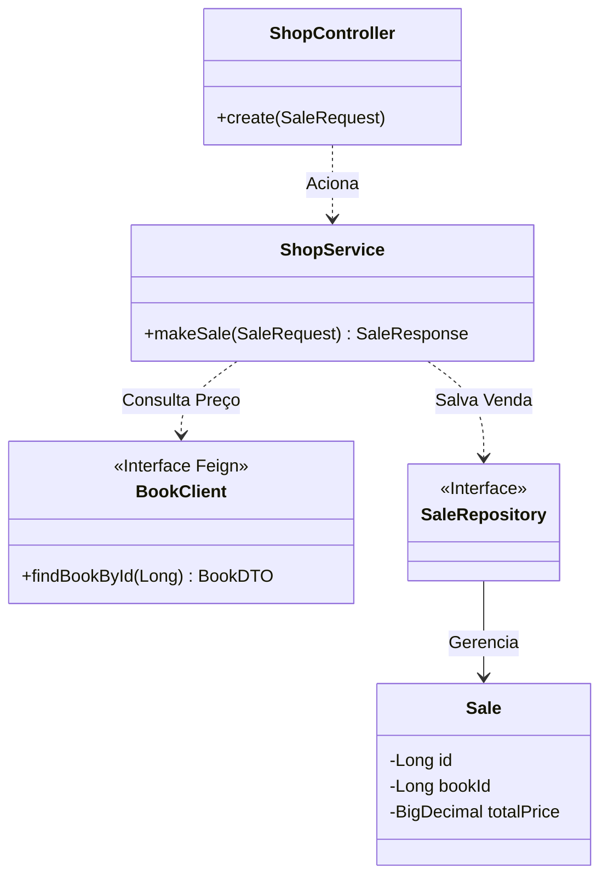

# 🛒 Shop Service (Consumer)

Microsserviço responsável pelo processamento de vendas e orquestração financeira. Ele consome dados do catálogo para validação e precificação, atuando como um agregador de regras de negócio.

---

## 🏗️ Arquitetura Interna

Este serviço implementa o padrão **Consumer-Side Integration** utilizando um cliente declarativo (OpenFeign) para comunicar-se com o Book Service.



---

## ⚙️ Configuração (Variáveis de Ambiente)

| **Variável** | **Descrição** | **Valor Padrão (Local)** |
| --- | --- | --- |
| `SERVER_PORT` | Porta HTTP do serviço | `8082` |
| `BOOK_SERVICE_URL` | URL do Provedor de Livros | `http://localhost:8081/books` |
| `DB_URL` | String de conexão JDBC | `jdbc:postgresql://localhost:5432/shop_db` |
| `DB_USER` | Usuário do banco | `postgres` |

---

## 🔌 API Reference

### Realizar Venda

`POST /sales`

**Request Body:**

```json
{
  "bookId": 1,
  "quantity": 2
}
```

**Comportamento:**

1. Verifica se `bookId` existe no *Book Service*.

2. Recupera o preço atual (`price`).

3. Calcula `totalPrice = price * quantity`.

4. Persiste a venda.


**Response (201 Created):**

```json
{
  "id": 10,
  "bookId": 1,
  "quantity": 2,
  "totalPrice": 200.00
}
```

---

## 📊 Observabilidade

Monitoramento ativo via Actuator.

| **Endpoint** | **Método** | **Função** |
| --- | --- | --- |
| `/actuator/health` | GET | Health Check (inclui status do DB e disco). |
| `/actuator/metrics` | GET | Métricas de performance. |

---

## ✅ Qualidade de Código (QA)

- **Cobertura:** > 80% (Validado via JaCoCo).

- **Estratégia de Teste:** O `BookClient` é "mockado" nos testes unitários para garantir que o build do Shop Service não quebre caso o Book Service esteja offline.


**Comando de Teste:**

```bash
./mvnw clean test
```
